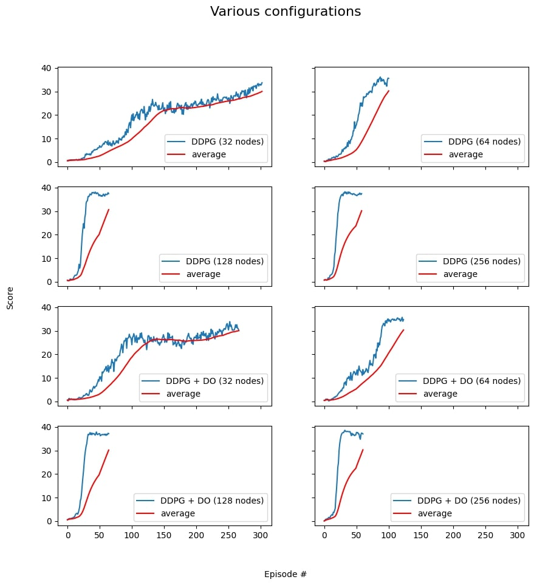

# Udacity Deep RL Project 2 Report: Continuous Control

GIF of the best performing agent

### Goal

The goal of this assignment was to train multiple agents using neural networks. The task is considered solved when a score of 30 or more is achieved over 100 consecutive episodes over all agents.

### Environment

In this project several similar agents aim to follow a target. A reward of +1 is provided for
each step that the agent’s hand is in the goal location. Thus, the goal of your agent is to maintain its position
at the target location for as many time steps as possible.

The environment space is defined by 33 variables by agent (position, rotation, velocity, and angular velocities
of the arm) and the action space contains 4 numbers corresponding to torque applicable to two joints.

### Approach

#### Learning Algorithm

[DDPG](https://arxiv.org/abs/1509.02971) which is an actor-critic approach was used as the learning algorithm for the agent.
This algorithm is quite similar to DQN, but also manages to solve tasks with continuous action spaces. As an off-policy algorithm
DDPG utilizes four neural networks: a local actor, a target actor, a local critic and a target critic

Each training step the experience (state, action, reward, next state) the 20 agents gained was stored.
Then every second training step the agent learned from a random sample from the stored experience. The actor tries to estimate the
optimal policy by using the estimated state-action values from the critic while critic tries to estimate the optimal q-value function
and learns by using a normal q-learning approach. Using this approach one gains the benefits of value based and policy based
methods at the same time.

#### Model architecture

The architecture of the model was simple. It consisted of two hidden layers with the option to add a dropout layer. The input layer had the dimension 33x1 for the 33 different state spaces. Next, there were two fully connected layers with the number of nodes kept the same and adjustable. There was the option to add a dropout layer between the two fully connected layers to help prevent any overfitting that may occur, this had a dropout probability of 50%.

#### Hyperparameters

| Hyperparameter | Value |
| -------------- | ----- |
| beta start | 1.0 |
| beta decay | 0.995 |
| min beta | 0.01 |
| γ (Discount factor) | 0.99 |
| τ | 1e-3  |
| Learning rate (actor & critic) | 5e-4 |
| Replay buffer size | 1e5 |
| Batch size | 128 |
| Update interval | 4 |
| Max number of episodes | 500 |

### Results

8 different configurations were run. The number of nodes and dropout layers was changed and added. The image below is the output from running all the configurations.

| Configuration | Number of episodes to solve | Average Score |
| ------------- | --------------------------- | ------------- |
| DDPG (32 nodes) | 253 | 30.05 |
| DDPG (64 nodes) | 51 | 30.26 |
| DDPG (128 nodes) | 15 | 30.66 |
| DDPG (256 nodes) | 9 | 30.17 |
| DDPG + DO (32 nodes) | 217 | 30.07 |
| DDPG + DO (64 nodes) | 74 | 30.35 |
| DDPG + DO (128 nodes) | 15 | 30.15 |
| DDPG + DO (256 nodes) | 11 | 30.28 |

The next image is the plots for each of the configurations.

### Conclusion

The more nodes that were added, the faster the agent solved the environment. Adding a dropout layer had no real affect on the results and the agent often performed slightly better with no dropout layer. The best agent was DDPG with 256 ndoes

### Future Improvements

* Try more nodes and investigate the effects and time to train
* Try models with more layers
* Implement Prioritized Experience Replays which would improve the learngin effectgained from the previous expereinces
* Implement parallel algorithms such as A3C